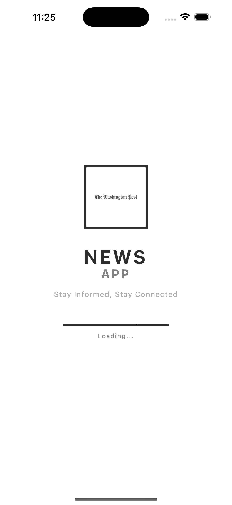

# 📰 News App - Elegant Black & White Design

A sophisticated news application built with **Expo React Native** featuring a **minimalist black and white design** with zero radius and clean typography. Built using **Clean Architecture** principles with comprehensive filtering and settings.

## ✨ Design Philosophy

This app embraces a **premium newspaper aesthetic** with:

- **Pure Black & White** color scheme
- **Zero radius** borders and buttons
- **No shadows** - flat, clean design
- **Typography-first** approach
- **High contrast** for maximum readability
- **Professional newspaper layout**

## 🎨 Screenshots

### 📱 App Interface Overview

<div align="center">

|                Headlines Screen                |               Search Screen                |
| :--------------------------------------------: | :----------------------------------------: |
|       |      |
| _Main headlines with elegant filtering system_ | _Clean search interface with sort options_ |

|                 Article Detail                 |             Settings Screen              |
| :--------------------------------------------: | :--------------------------------------: |
|  |  |
|       _Full article view with metadata_        |     _Comprehensive user preferences_     |

</div>

### 🎯 Design Highlights

- **Custom Header**: App icon integration with "NEWS APP" branding
- **Bottom Navigation**: Bordered icon containers with active states
- **Article Cards**: Source badges, relative dates, and clean typography
- **Filter System**: Category chips and modal selections
- **Settings Interface**: Organized sections with toggle switches
- **Typography**: Consistent font hierarchy and letter spacing

## 🚀 Key Features

### 📱 **Headlines Screen**

- Top news headlines with category filtering
- Comprehensive filter system (Country, Source, Date Range)
- Custom app icon in header
- Pull-to-refresh functionality
- Elegant article cards with source badges

### 🔍 **Search Screen**

- Real-time news search
- Sort by relevance, popularity, or date
- Advanced search parameters
- Clean search interface

### ⚙️ **Settings Screen**

- Comprehensive user preferences
- Default country, category, and sort order
- Display settings (images, font size, compact view)
- Auto-refresh configuration
- Offline reading and notifications options

### 📄 **Article Detail Screen**

- Full article view with all API fields
- No external URL launching (security-focused)
- Clean typography and layout
- Article metadata and source information

## 🏗️ Architecture

### **Clean Architecture Implementation**

```
📁 Domain Layer
├── entities/          # Article, Source models
├── repositories/      # NewsRepository interface
└── usecases/         # GetTopHeadlines, SearchArticles

📁 Data Layer
└── repositories/      # NewsRepositoryImpl with API integration

📁 Infrastructure Layer
├── api/              # NewsApiClient with Axios
├── config/           # API configuration
└── di/               # Dependency injection container

📁 Application Layer
├── services/         # NewsService business logic
└── providers/        # React Context providers

📁 Presentation Layer
├── components/       # Reusable UI components
├── screens/          # Screen components
└── navigation/       # Custom navigation with headers
```

### **State Management**

- **Settings Provider**: AsyncStorage persistence
- **News Provider**: Article state management
- **Dependency Injection**: Clean service instantiation

## 🛠️ Technologies & Libraries

### **Core Technologies**

- **Expo SDK** - React Native development platform
- **TypeScript** - Type safety and developer experience
- **React Navigation** - Custom navigation with elegant headers
- **React Native Paper** - Material Design components (customized)
- **AsyncStorage** - Settings persistence

### **API & Networking**

- **Axios** - HTTP client for News API integration
- **News API** - Real-time news data source

### **Design & UI**

- **Custom Components** - Bespoke UI elements
- **Vector Icons** - MaterialIcons integration
- **Responsive Design** - Adaptive layouts
- **Typography System** - Consistent font scaling

## 📱 Design Components

### **Custom Header**

```typescript
// Features app icon, elegant typography, and back navigation
- App icon integration (icon.png)
- "NEWS APP" branding
- Custom back button with borders
- Clean divider lines
```

### **Bottom Navigation**

```typescript
// Professional tab bar with custom styling
- Bordered icon containers
- Active state: black background, white icons
- UPPERCASE labels with letter spacing
- 70px height for better accessibility
```

### **Article Cards**

```typescript
// Newspaper-style article presentation
- Source badges with black backgrounds
- Relative date formatting ("2d ago")
- Author attribution with italic styling
- Clean image borders (2px black)
- Typography hierarchy
```

### **Filter System**

```typescript
// Comprehensive filtering options
- Category chips (horizontal scroll)
- Country, Source, Date range modals
- Clear filters functionality
- Selected state indicators
```

## 🚀 Getting Started

### **Prerequisites**

- Node.js (v16 or higher)
- Expo CLI or Expo Development Build
- News API key from [newsapi.org](https://newsapi.org)

### **Installation**

1. **Clone the repository:**

```bash
git clone <repository-url>
cd news_api_expo
```

2. **Install dependencies:**

```bash
npm install
```

3. **Configure News API:**

   - Get your free API key from [newsapi.org](https://newsapi.org)
   - Copy the sample environment file: `cp .env.example .env`
   - Open `.env` and replace `your_api_key_here` with your actual API key
   - **Important:** Never commit the `.env` file to version control

4. **Run the application:**

```bash
# iOS Simulator
npx expo run:ios

# Android Emulator
npx expo run:android

# Web Browser
npx expo start --web

# Development Build
npx expo start
```

## ⚙️ Configuration Options

### **User Settings** (Persisted with AsyncStorage)

```typescript
interface UserSettings {
  defaultCountry: string; // 'us', 'gb', 'ca', etc.
  defaultCategory: string; // 'general', 'business', etc.
  defaultSortBy: string; // 'publishedAt', 'relevancy', 'popularity'
  articlesPerPage: number; // 10, 20, 30, 50
  showImages: boolean; // Display article images
  compactView: boolean; // Compact article layout
  fontSize: string; // 'small', 'medium', 'large'
  autoRefresh: boolean; // Auto-refresh functionality
  refreshInterval: number; // Minutes between refreshes
  imageQuality: string; // 'low', 'medium', 'high'
  notifications: boolean; // Push notifications (future)
  offlineReading: boolean; // Offline support (future)
}
```

### **API Configuration**

```typescript
// Available endpoints and parameters
- Top Headlines: /top-headlines
- Search Everything: /everything
- Supported countries: US, UK, CA, AU, DE, FR, JP, IN, BR, MX
- Categories: general, business, technology, sports, entertainment, health, science
```

## 📐 Design System

### **Typography Scale**

```typescript
- Headers: 24px-36px (Bold, Letter spacing)
- Body: 14px-16px (Regular/Medium)
- Captions: 9px-12px (Semibold, Uppercase)
- Line Heights: 1.4-1.6x font size
```

### **Color Palette**

```typescript
- Primary: #000000 (Pure Black)
- Background: #ffffff (Pure White)
- Text Primary: #000000
- Text Secondary: #666666
- Text Tertiary: #999999
- Borders: #000000, #e0e0e0
- Surfaces: #f8f8f8
```

### **Spacing System**

```typescript
- Base Unit: 4px
- Scale: 4px, 8px, 12px, 16px, 20px, 24px, 32px
- Border Weights: 1px (dividers), 2px (elements), 3px (emphasis)
```

## 🔒 Security Features

- **No External URL Opening**: Articles are displayed in-app only
- **Input Validation**: Search and filter input sanitization
- **API Key Security**: Environment variables for sensitive data
- **Error Handling**: Comprehensive error states and messages
- **Environment File Protection**: `.env` files excluded from version control

## 🎯 Performance Optimizations

- **Image Loading**: Configurable image quality settings
- **Pagination**: User-configurable articles per page
- **Caching**: Efficient state management
- **Bundle Size**: Optimized imports and dependencies

## 📄 API Integration

### **News API Endpoints**

```typescript
// Top Headlines
GET / top - headlines;
Parameters: country, category, sources, pageSize;

// Search Everything
GET / everything;
Parameters: q, sortBy, sources, from, to, pageSize;
```

### **Error Handling**

- Network connectivity issues
- API rate limiting
- Invalid API responses
- Empty search results
- Image loading failures

## 🤝 Contributing

### **Development Guidelines**

1. Follow Clean Architecture principles
2. Maintain black & white design consistency
3. Use TypeScript for all new code
4. Add comprehensive error handling
5. Test on multiple screen sizes

### **Code Style**

```typescript
// Consistent formatting
- 2-space indentation
- Semicolons required
- Single quotes for strings
- Trailing commas in objects/arrays
```

## 📈 Future Enhancements

### **Planned Features**

- [ ] Dark mode toggle (maintaining black/white theme)
- [ ] Offline article caching
- [ ] Push notifications for breaking news
- [ ] Article bookmarking system
- [ ] Social sharing capabilities
- [ ] Multiple language support
- [ ] Advanced search filters
- [ ] Reading history tracking

### **Performance Improvements**

- [ ] Image caching optimization
- [ ] Background refresh functionality
- [ ] Infinite scroll pagination
- [ ] Search result caching

## 📄 License

This project is licensed under the **MIT License** - see the LICENSE file for details.

## 🙏 Acknowledgments

- **News API** for providing comprehensive news data
- **Expo Team** for the excellent development platform
- **React Native Community** for the robust ecosystem
- **The Washington Post** typography inspiration for the elegant design

---

**Built with ❤️ using Clean Architecture and elegant design principles**
